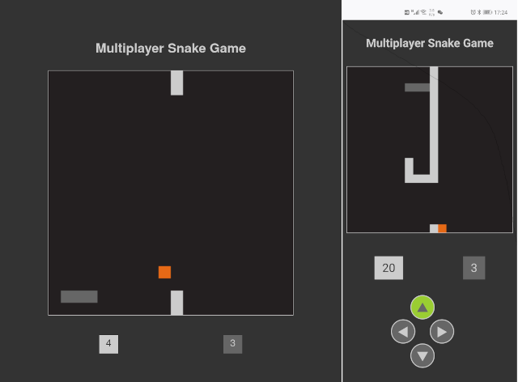

# Multiplayer Snake Game

[](https://david-dm.org/archtaurus/multiplayer-snake-game)

A multiplayer snake game based on express and socket.io.

## Run

``` shell
yarn install
yarn start
firefox http://localhost:8000
```

## Features

- [X] simple, clear and responsive UI
- [x] multiplayer and observers

## Screenshots

Screenshot on PC and Phone



## History

- Version 1.0.0
  - first release
